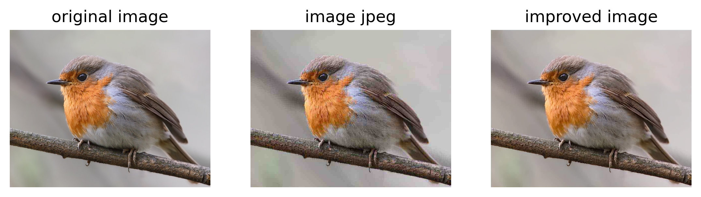

# GAN для улучшения качества изображений после сжатия JPEG

## Описание

JPEG-сжатие часто ведет к потере деталей и появлению артефактов, таких как блокирование и размытие.

Для воостановления изображения после JPEG-сжатия с помощью библиотек cv2 и numpy был создала датасет, которой хранит исходное изображение и его сжатую версию, после была обучена нейросеть на основе GAN архитектуры.

## Пример работы нейросети

